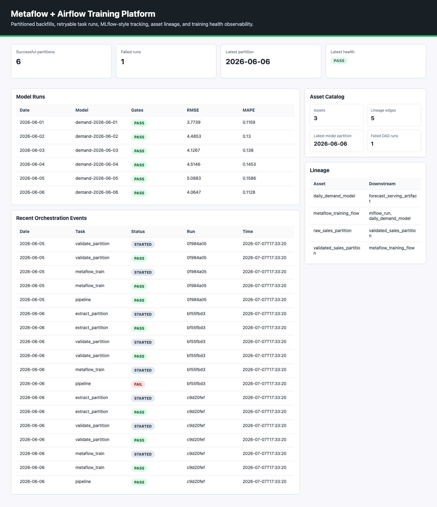
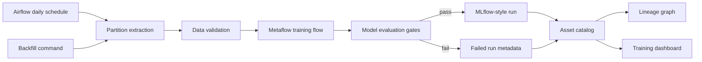

# Metaflow + Airflow Training Orchestration Platform

[](https://github.com/kevinmeix1/metaflow-airflow-training-platform/actions/workflows/ci.yml)

A production-style training orchestration project that demonstrates partitioned backfills, retryable task runs, Metaflow-style training, Airflow scheduling, MLflow-style tracking, asset lineage, failure recovery, and training health observability.

The default demo runs locally with no external services. Airflow and Metaflow integration files show how the same lifecycle maps to production orchestration.



## What This Demonstrates

- Daily partitioned training data
- Backfills across date ranges
- Idempotent reruns that skip successful partitions
- Forced recovery runs for failed partitions
- Retryable task-level metadata
- Data validation gates
- Metaflow-style train and evaluate flow
- MLflow-style run and artifact logging
- Asset catalog and lineage graph
- Airflow DAG shape for scheduled catchup
- Dashboard for run history, model quality, failures, and lineage

## Architecture



## Quick Start

```bash
make demo
make test
```

Open the generated dashboard:

```bash
open .local/reports/training_orchestration_dashboard.html
```

## Commands

```bash
make demo      # run initial backfill, idempotency check, failure drill, recovery, dashboard
make backfill  # run a fixed example backfill
make run       # run one fixed partition
make dashboard # rebuild dashboard from existing metadata
make test      # run tests
```

You can also call the CLI directly:

```bash
PYTHONPATH=src python3 -m training_orchestration_platform backfill --output .local --start 2026-06-01 --end 2026-06-05
PYTHONPATH=src python3 -m training_orchestration_platform run --output .local --date 2026-06-06 --force
```

## Production-Grade Refinements

See [production-grade refinements](docs/production-grade-refinements.md) for the asset-aware Airflow DAG, partition manifests, SHA-256 input fingerprints, lineage, and backfill semantics.

For the latest training mesh orchestration pass, see [advanced orchestration assessment](docs/advanced-orchestration-assessment.md).

For the Kubernetes/Airflow robustness layer, see [Kubernetes and Airflow robustness](docs/kubernetes-airflow-robustness.md).

For the operator-facing backfill planner, see [advanced backfill control plane](docs/control-plane-depth.md).

For Airflow 3 queue, runtime, and failed-partition Deadline Alerts with bounded callbacks, see [Airflow deadline alerts](docs/airflow-deadline-alerts.md).

For the policy-as-code audit layer, see [security and governance](docs/security-governance.md).

For OpenTelemetry-style runtime traces, see [observability and tracing](docs/observability-tracing.md).

For controlled failure injection and recovery objectives, see [resilience and chaos drills](docs/resilience-chaos.md).

For workload right-sizing, HPA/VPA guardrails, and Airflow pool sizing, see [resource optimization](docs/resource-optimization.md).

For runtime network boundaries, mTLS, and allow-listed service flows, see [network security](docs/network-security.md).

For auditable environment promotion with Argo CD and Argo Rollouts, see [GitOps promotion](docs/gitops-promotion.md).

For backup schedules, restore order, and RPO/RTO evidence, see [disaster recovery](docs/disaster-recovery.md).

For model cards, partition data cards, risk controls, approval records, and reproducibility hashes, see [governance evidence](docs/governance-evidence.md).

For training SLOs, partition failure burn, and backfill-freeze automation, see [SLO and error budget automation](docs/slo-error-budget.md).

For EKS Auto Mode, Terraform, managed-service mappings, and portability notes, see [cloud migration](docs/cloud-migration.md).

For GitHub artifact attestations, SLSA provenance, Sigstore policy-controller admission, and checksum evidence, see [supply chain provenance](docs/supply-chain-provenance.md).

For an automated scan of advanced Airflow, Kubernetes, lineage, scaling, GitOps, and security controls, see [orchestration scorecard](docs/orchestration-scorecard.md).

For GPU ResourceFlavors, Dynamic Resource Allocation notes, MIG/time-slicing trade-offs, and accelerator quota planning, see [accelerator scheduling](docs/accelerator-scheduling.md).

For concrete DRA ResourceClaimTemplates, Kueue-coupled training admission, and CPU fallback paths, see [dynamic resource allocation](docs/dynamic-resource-allocation.md).

For Kueue topology-aware backfills, rack-level placement, Airflow scheduler spread, and wave-splitting fallbacks, see [topology-aware scheduling](docs/topology-aware-scheduling.md).

For elastic KubeRay backfill waves, Kueue admission, GPU worker bounds, and Metaflow recovery fallbacks, see [KubeRay and Kueue](docs/kuberay-kueue.md).

For Gateway API Inference Extension handoff artifacts, stable `InferencePool`, Endpoint Picker fallback, and promoted champion route priorities, see [Gateway API Inference Extension](docs/inference-gateway.md).

For Airflow, Kueue, Metaflow, MLflow, OpenLineage, partition, and Kubernetes telemetry attributes with row redaction, see [semantic telemetry contract](docs/semantic-telemetry.md).

For training tenant quotas, Kueue cohorts, Airflow pools, recovery reservations, chargeback labels, and noisy-neighbor controls, see [multi-tenant fairness](docs/multi-tenant-fairness.md).

For projected service-account tokens, External Secrets, SPIFFE identities, and keyless Airflow/Metaflow task access, see [workload identity](docs/workload-identity.md).

For partition throughput, wave-packing, Airflow queue, and recovery regression gates, see [performance budgets](docs/performance-budgets.md).

For Kueue quota pressure, indexed backfill priority, failed-partition preemption, GPU use, and Airflow pool examples, see [queue capacity simulation](docs/queue-capacity-simulation.md).

For fail-closed backfill admission that combines SLOs, capacity planning, queue priority, governance, provenance, and recovery reservations, see [release admission control](docs/release-admission-control.md).

## Airflow And Metaflow Split

Airflow owns schedule, catchup, backfill policy, alerting, and dependency coordination. Metaflow owns the training flow boundaries: start, train, evaluate, artifact capture, and step retry behavior.

The local implementation mirrors that split:

- `airflow/dags/demand_training_dag.py` shows the DAG shape.
- `metaflow_flows/demand_training_flow.py` shows the training flow shape.
- `src/training_orchestration_platform/orchestrator.py` runs the local equivalent.

## Failure Recovery

The demo intentionally creates a failed training run for `2026-06-06`, then reruns that partition with `force=True`. The run history keeps both records, so reviewers can see the failure and recovery trail.

## Interview Talking Points

- Why backfills should be idempotent by partition.
- How Airflow catchup differs from a model retraining trigger.
- Why Metaflow is useful for artifact lineage and step retry.
- How MLflow run metadata connects model artifacts to training data.
- How to design run tables for incident response.
- How asset lineage answers "what downstream model used this partition?"
