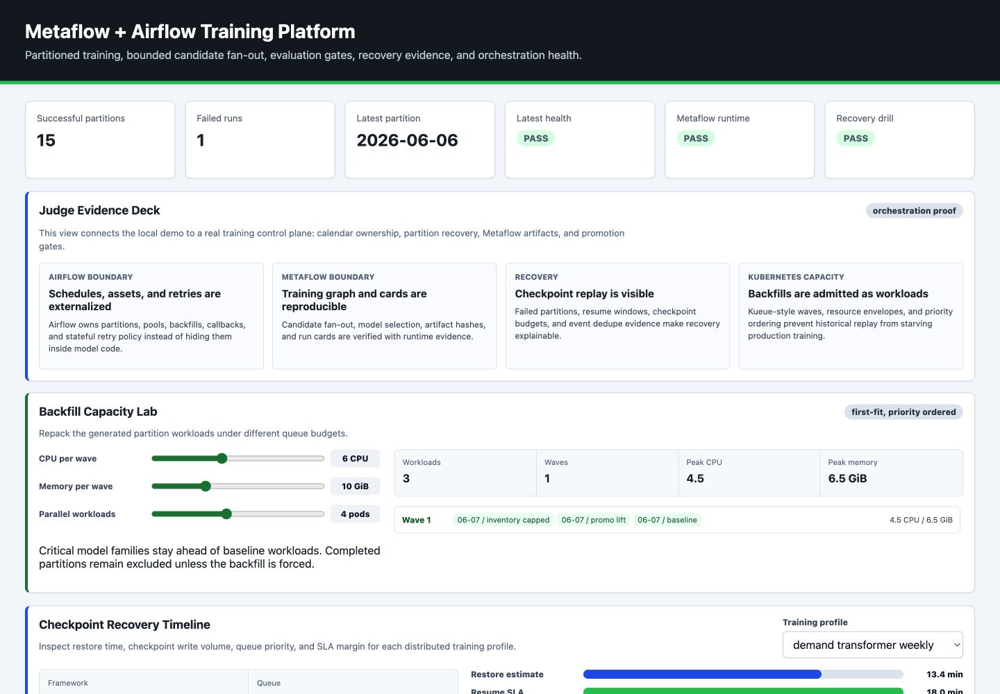
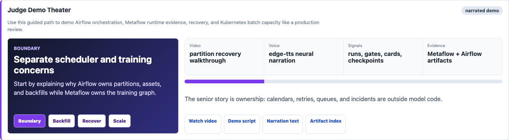
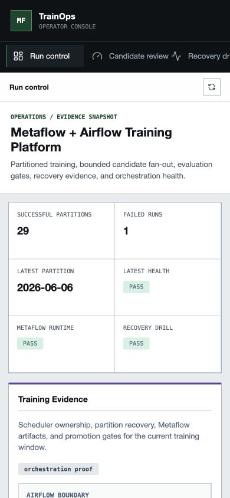
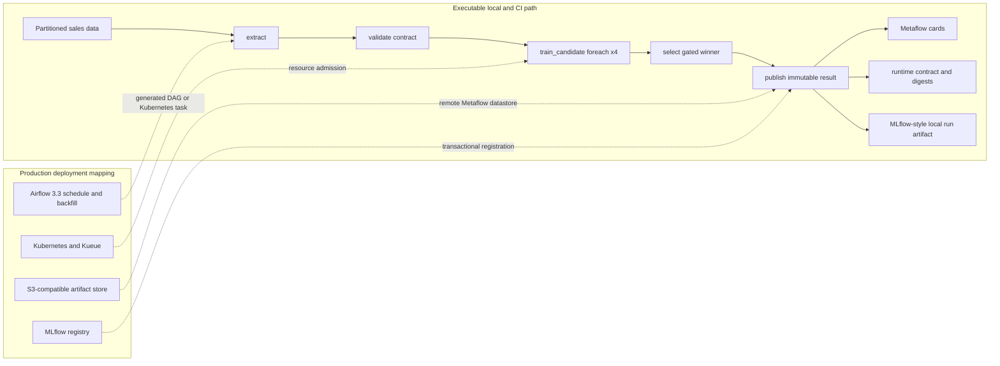

# Metaflow and Airflow Training Orchestration

[](https://github.com/kevinmeix1/metaflow-airflow-training-platform/actions/workflows/ci.yml)

A local-first, production-style training control plane for partitioned demand
forecasting. It demonstrates orchestration boundaries, bounded candidate
fan-out, evaluation gates, artifact lineage, idempotent publication, backfills,
and failed-partition recovery.

This is a portfolio system, not a production service. The repository separates
code that runs in local CI from Airflow and Kubernetes deployment designs that
require a real cluster and shared infrastructure.


[Watch the narrated judge demo](docs/demo/training-judge-demo.mp4) | [Follow the live demo script](docs/judge-demo.md) | [Checkpoint training dashboard capture](docs/screenshots/dashboard-checkpoint-training.png) | [Checkpoint recovery timeline](docs/screenshots/dashboard-checkpoint-timeline.png)





## Implementation Status

| Capability | Evidence | Status |
| --- | --- | --- |
| Deterministic local training control plane | `make demo` and unit tests | Executable |
| Metaflow 2.19.29 training flow | `make metaflow-runtime-contract` | Executable in CI |
| Four-way candidate `foreach`, gates, cards, artifacts | Metaflow run verifier and uploaded CI evidence | Executable in CI |
| Failed publish, retry exhaustion, and `resume` lineage | `make metaflow-resume-contract` | Executable in CI |
| Airflow 3.3 task and asset state DAG | `make airflow-sdk-contract` | SDK parse-verified in CI |
| Checkpointed distributed training readiness | `make checkpoint-training-readiness` | Deterministic Kubernetes mapping |
| Interactive backfill capacity lab | Browser-tested CPU, memory, and concurrency repacking | Executable locally |
| Metaflow-generated Airflow DAG | Official export command and environment contract | Deployment mapping |
| Kueue, Kubernetes, DRA, KubeRay, GitOps, and policy assets | YAML and deterministic policy reports | Reference design |
| MLflow service and remote object storage | Local compatible artifact contract | Deployment mapping |

An integration name in a diagram does not mean that service is running. The
status column above is the source of truth.

## Quick Start

The dependency-free demo exercises partition backfills, failure recovery,
lineage, governance reports, and the dashboard:

```bash
make clean
make demo
make test
open .local/reports/training_orchestration_dashboard.html
```

In the Backfill Capacity Lab, lower CPU per wave from 6 to 2. The same three
priority-ordered workloads are repacked from one wave into three without
rerunning the pipeline. The dashboard also exposes the real Metaflow runtime
contract, candidate fan-out, immutable registration key, failed boundary,
cloned resume lineage, and recent orchestration events.

The Checkpoint Recovery Timeline lets reviewers switch between production
backfill and exploratory HPO profiles, then inspect restore time, resume SLA,
checkpoint write volume, queue priority, and recovery decision in one place.

The operator console is responsive at review and incident-response sizes:



Run the actual Metaflow engine and its executable contract:

```bash
python3.12 -m venv .venv
.venv/bin/python -m pip install --upgrade "pip==25.3"
.venv/bin/python -m pip install \
  --constraint requirements-metaflow.lock \
  "build==1.5.1" "setuptools==83.0.0" "wheel==0.47.0"
.venv/bin/python -m pip install \
  --no-build-isolation \
  --constraint requirements-metaflow.lock \
  --editable ".[metaflow-runtime,dev]"
make metaflow-runtime-contract METAFLOW_PYTHON=.venv/bin/python
make metaflow-resume-contract METAFLOW_PYTHON=.venv/bin/python
```

The runtime commands fail if the graph, fan-out, gate-aware selection, digests,
cards, idempotency key, published artifacts, retry attempts, or cloned resume
lineage differ from the contract.

## Architecture



Solid edges run locally. Dotted edges identify deployment work that is not
claimed as an active local integration.

## Executable Metaflow Contract

`metaflow_flows/demand_training_flow.py` is a real `FlowSpec`, not a diagram or
command-string wrapper.

| Step | Responsibility | Failure policy |
| --- | --- | --- |
| `start` | Normalize the partition and bounded candidate grid | Reject malformed or duplicate candidates |
| `extract` | Materialize the deterministic partition and content manifest | Two bounded retries, atomic manifest write |
| `validate` | Enforce row, schema, numeric, and SKU contracts | Fail immediately because bad data is not transient |
| `train_candidate` | Fan out four independent model configurations | Per-candidate resources, timeout, two retries, card |
| `select_model` | Select the best gate-passing candidate deterministically | Fail closed when no candidate passes |
| `publish` | Write model, metrics, gates, comparison, and run contract | Atomic writes, stable registration key, card |
| `end` | Expose the immutable result as a Metaflow artifact | Verified against the published contract |

The verifiers use the Metaflow Client and Runner APIs to inspect all seven steps
and ten tasks. They also check five rendered cards, source and model hashes,
relative artifact paths, candidate uniqueness, a single run-history publication,
retry exhaustion, origin pathspecs, and the fresh execution boundary after
resume.

See [Executable Metaflow Runtime](docs/executable-metaflow-runtime.md) for the
contract and deployment details.

## Airflow and Metaflow Boundary

Airflow owns calendars, asset-triggered scheduling, catchup, backfill policy,
cross-team dependencies, pools, and incident callbacks. Metaflow owns the model
code graph, candidate fan-out, task artifacts, retry boundaries, and run lineage.

The repository validates an Airflow 3.3 SDK DAG in CI. For an organization that
already operates Airflow, Metaflow can also export this `FlowSpec` as a DAG:

```bash
set -a
. airflow/metaflow-export.env
set +a
python metaflow_flows/demand_training_flow.py \
  --with retry airflow create generated/demand_training_dag.py
```

Copy `airflow/metaflow-export.env.example` and supply a remote datastore and
metadata service. Metaflow intentionally refuses local-datastore Airflow export
because scheduler workers need shared artifacts.

The generated DAG exposes `ds` as an Airflow parameter. Its committed
`2026-06-08` default exists only to make local runs reproducible. Production
dispatch must map the Airflow data interval or asset partition key into `ds`.
Running scheduled exports with the default would retrain the same partition, so
the stateful Airflow DAG remains the preferred production partition owner.

The generated-DAG path supports `foreach`, but not nested `foreach`. Metaflow
conditional and recursive steps are not supported by its Airflow exporter. The
generated file must be deployed through the Airflow DAG distribution mechanism;
the Metaflow Deployer API does not deploy Airflow DAGs.

## Reliability Model

- Input manifests carry SHA-256 content fingerprints and partition idempotency
  keys.
- Candidate names and parameter bounds are validated before fan-out.
- Data contract failures are terminal; extraction and publication failures are
  retryable and bounded.
- Promotion fails closed when every candidate misses an evaluation gate.
- The registration key hashes the partition, input content, selected config,
  and runtime contract version.
- Model and report files use temp-file replacement so readers never observe a
  partially written JSON artifact.
- Repeating publication for one Metaflow run produces one run-history record.
- Repeating publication for one run returns the exact original contract; a
  changed pathspec or payload under that run ID fails closed.
- Resumed contracts record the origin run, failed boundary, and successful
  publish retry count without copying large upstream artifacts.
- `RUNTIME_CONTRACT_VERSION` must be bumped when training semantics or artifact
  schemas change, so retry identity cannot silently cross a code contract.

The local JSONL history assumes one publisher. A production registry must
enforce the registration key with a database uniqueness constraint in the same
transaction that moves the model stage.

## Failure Recovery

The local demo creates a failed `2026-06-06` partition, records the incident,
and recovers it with a forced replay while preserving both attempts.

The executable Metaflow drill is stronger than the simulator:

```bash
make metaflow-resume-contract METAFLOW_PYTHON=.venv/bin/python
```

It forces `publish` to exhaust its initial attempt and two retries, resumes the
specific failed run with the fault removed, proves eight upstream tasks were
cloned from that origin, and proves only `publish` and `end` ran fresh. Candidate
cards remain attached to the origin tasks; the verifier follows that lineage
instead of expecting copied card files.

Metaflow step artifacts are durable boundaries. Resume a failed local run with:

```bash
METAFLOW_DEFAULT_DATASTORE=local \
METAFLOW_DATASTORE_SYSROOT_LOCAL="$PWD/.local/metaflow/datastore" \
PYTHONPATH="$PWD/src" \
.venv/bin/python metaflow_flows/demand_training_flow.py \
  resume --origin-run-id RUN_ID
```

In Airflow, retry only the failed partition/task instance and preserve the
original run and partition identifiers. Do not rerun a broad backfill to hide a
single failed state transition.

## Commands

| Command | Purpose |
| --- | --- |
| `make demo` | Run deterministic backfill, failure, recovery, and report generation |
| `make metaflow-runtime-contract` | Execute and verify the real Metaflow flow |
| `make metaflow-resume-contract` | Inject a publish failure, resume it, and verify cloned lineage |
| `make verify-metaflow-lock` | Reject missing, extra, or version-drifted runtime dependencies |
| `make package-smoke` | Build with pinned tools and import the wheel with site packages disabled |
| `make airflow-sdk-contract` | Parse and inspect Airflow 3.3 SDK DAGs |
| `make run` | Run one fixed partition through the local control plane |
| `make backfill` | Execute a fixed multi-partition backfill |
| `make plan-backfill` | Build bounded backfill waves and skipped-partition evidence |
| `make checkpoint-training-readiness` | Generate Metaflow checkpoint, JobSet, Kueue, and resume-SLA evidence |
| `make dashboard` | Regenerate the reviewer dashboard from current artifacts |
| `make demo-voice` | Generate the neural judge narration with `edge-tts` |
| `make demo-video` | Assemble the committed narrated desktop and mobile walkthrough |
| `make test` | Run domain, failure, manifest, and runtime unit tests |
| `make ci-verify` | Validate the complete generated evidence bundle |

## Repository Map

```text
airflow/dags/                 Airflow 3.3 and deployment DAG contracts
metaflow_flows/               Executable FlowSpec
src/training_orchestration_platform/
                              Local control plane and policy evidence builders
tools/verify_metaflow_run.py  Runtime evidence verifier
tools/verify_metaflow_resume.py
                              Failed-run and resume-lineage verifier
kubernetes/                   Version-aware reference manifests and policies
docs/                         Decisions, runbooks, and production mappings
tests/                        Domain, failure, and contract tests
```

## Selected Design Notes

- [Airflow 3.3 Stateful Orchestration](docs/airflow-stateful-orchestration.md)
- [Production Refinements](docs/production-grade-refinements.md)
- [Kubernetes and Airflow Robustness](docs/kubernetes-airflow-robustness.md)
- [Advanced Backfill Control Plane](docs/control-plane-depth.md)
- [SLO and Error Budget Automation](docs/slo-error-budget.md)
- [Supply Chain Provenance](docs/supply-chain-provenance.md)
- [Workload-Aware Scheduling](docs/workload-aware-scheduling.md)
- [Cloud Migration](docs/cloud-migration.md)

The remaining documents are focused reference designs under `docs/`; they are
not additional claims of live infrastructure.

## Interview Talking Points

- Why invalid data should not consume retries intended for transient failures.
- Why `foreach` artifacts make candidate lineage easier to inspect than an
  opaque hyperparameter loop inside one task.
- How a stable registration key prevents duplicate promotion after task retry.
- Why Airflow should own backfill policy while model code remains portable.
- Which state is sufficient to resume one failed partition safely.
- Why resumed cards and artifacts should be followed through origin pathspecs
  instead of physically duplicated into the new run.
- Why Kubernetes manifests are reference designs until a cluster smoke test
  proves controller availability and runtime behavior.
- When an existing Airflow estate justifies Metaflow export, and when Argo
  Workflows is the cleaner Metaflow deployment target.

The senior signal in this project is the boundary: a small executable core with
strong evidence, plus explicit production mappings that are not misrepresented
as running services.
