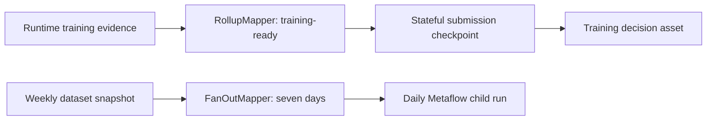

# Airflow 3.3 Stateful Metaflow Orchestration

This refinement applies Airflow 3.3 state stores, partition mappers, runtime partitioning, and exception-aware retries to Metaflow training and backfill workflows. CI parses the DAG module against `apache-airflow==3.3.0`; the local demo remains dependency-light.

## Implemented Evidence

- Runtime data-contract, manifest, and capacity evidence rolls up into one training decision.
- A weekly dataset snapshot fans out to seven daily training partitions with an explicit start date and catchup behavior.
- Task state persists Metaflow and MLflow run IDs so retries reattach instead of resubmitting training.
- Asset state persists the dataset manifest digest and last Metaflow run ID across DAG runs.
- CI installs constrained Airflow, runs `pip check`, imports expected DAGs, calls `DAG.validate()`, and rejects empty DAGs.



## State Boundaries

| Mechanism | Stored | Why |
| --- | --- | --- |
| Task state store | Metaflow run ID, MLflow parent run ID, progress | retry-safe reattachment to external jobs |
| Asset state store | dataset manifest digest, last run ID | point the next run at immutable cross-run lineage |
| Object store / MLflow | datasets, models, metrics, artifacts | keep large payloads out of Airflow metadata |

External run IDs use `NEVER_EXPIRE` because they are idempotency keys. Training progress follows normal retention and can be garbage-collected.

## Failure Semantics

- Infrastructure connection failures retry with bounded delay.
- `ValueError` represents a terminal data-contract failure and fails fast.
- Replays preserve the original dataset digest and external run identity.
- Fanout is capped at seven partitions; capacity and pool controls still bound concurrent work.
- Backfill correctness still depends on source availability and immutable manifests.

## Verification

```bash
make airflow-stateful-orchestration
make airflow-sdk-contract
```

The SDK contract command requires the `airflow33` optional dependency. CI uses Airflow's official Python 3.11 constraints.

## Production Boundary

The local project does not start Airflow, Metaflow metadata, MLflow, or Kubernetes. The gate proves DAG authoring compatibility, not live job reattachment. A production test would kill workers after submission, verify reattachment, exercise scheduler failover, and reconcile exactly one external run per partition.

References: [state-store overview](https://airflow.apache.org/docs/apache-airflow/stable/core-concepts/task-and-asset-state-store.html), [asset partitioning](https://airflow.apache.org/docs/apache-airflow/stable/authoring-and-scheduling/assets.html), [retry policies](https://airflow.apache.org/docs/apache-airflow/stable/core-concepts/tasks.html#retry-policies), and [constrained installation](https://airflow.apache.org/docs/apache-airflow/stable/installation/installing-from-pypi.html).
