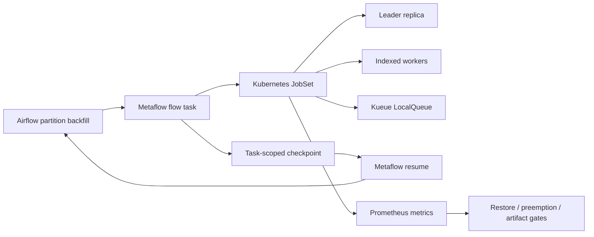

# Checkpointed Distributed Training

This slice shows how the platform would run larger Metaflow training jobs without losing recovery guarantees. It combines Metaflow checkpoint semantics, Airflow partition identity, Kueue quota admission, and Kubernetes JobSet-style distributed workers.

## What It Demonstrates

- Metaflow task-scoped checkpoints for retry-safe recovery.
- Airflow partition keys and map indexes kept stable across resume attempts.
- JobSet replica groups for leader/worker distributed training.
- Kueue LocalQueues separating production backfills from preemptible HPO sweeps.
- Resume SLA modeling for checkpoint restore time.
- Checkpoint artifact storage budgets.
- Prometheus alerts for slow restore, production preemption, and checkpoint growth.

## Demo Commands

```bash
make checkpoint-training-readiness
make demo
make ci-verify
```

Generated evidence:

```text
.local/reports/checkpoint_training_readiness_plan.json
.local/reports/training_orchestration_dashboard.html
```

## Architecture



## Recovery Policy

The production partition keeps the same Airflow partition key and Metaflow task scope when resuming. If checkpoint upload, checksum validation, or restore exceeds the SLA, the platform holds downstream model registration and records the failure in release evidence. Exploratory HPO JobSets are preemptible; failed production partition replay is not.

## Production Notes

The local demo is deterministic, but the structure maps cleanly to a real cluster:

- Metaflow can checkpoint inside long-running tasks and resume from the latest task-scoped checkpoint.
- Airflow remains the scheduling and audit boundary.
- Kueue decides whether distributed JobSets can start based on quota and fair sharing.
- JobSet provides a Kubernetes-native representation for multi-pod training work.
- MLflow and OpenLineage receive the recovered run id, checkpoint version, and registered model artifact.
