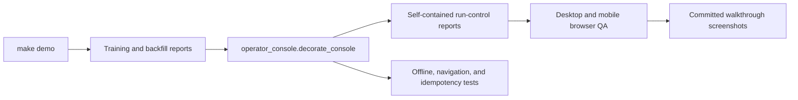

# TrainOps Operator Console

The generated UI is an offline run-control surface for partitioned training, candidate selection, recovery, and backfill capacity. It presents orchestration evidence as an operating system, not as a decorative DAG gallery.

## Design contract

- **Identity:** TrainOps uses graphite, workflow green, lineage violet, and capacity amber. Each accent has an ownership role.
- **Shape:** metric cells form one instrument rail; evidence and tables use matte ruled surfaces with minimal radius.
- **Density:** partition state, checkpoints, candidates, and resource budgets remain comparable without oversized cards.
- **Language:** runtime screens describe scheduler and training responsibilities. Interview prompts live in documentation.
- **Offline behavior:** CSS and Lucide-derived SVG paths are embedded in the generated HTML with no CDN or frontend build requirement.
- **Accessibility:** skip links, landmarks, active navigation, visible focus, reduced-motion handling, and responsive overflow checks are tested.

## Information architecture

| Surface | Operational question |
| --- | --- |
| Run control | Which partitions completed, failed, or resumed? |
| Candidate review | Is the selected model backed by complete runtime and gate evidence? |
| Recovery drill | Can a failed partition resume without duplicate publication? |
| Training signals | How do assets, checkpoints, queues, and release gates connect? |
| Demo runbook | What is the timed sequence for reviewing one training window? |
| Artifact ledger | Which immutable artifact supports each orchestration claim? |

## Open-source references

- [Tabler](https://docs.tabler.io/) (MIT) for application-shell anatomy and compact operational components.
- [PatternFly dashboard guidance](https://v5-archive.patternfly.org/patterns/dashboard/design-guidelines/) and [table guidance](https://v4-archive.patternfly.org/v4/components/table/design-guidelines/) for hierarchy and dense run tables.
- [Grafana dashboard guidance](https://grafana.com/docs/grafana/latest/visualizations/dashboards/build-dashboards/best-practices/) for constrained panels and documented intent.
- [Lucide](https://github.com/lucide-icons/lucide) (ISC) for inline navigation and refresh icon paths.

No upstream template CSS or runtime assets are copied. The shell and training-specific visual hierarchy are implemented in this repository.

## Review checklist

1. Run `make demo` and open `.local/reports/training_orchestration_dashboard.html`.
2. Verify all six navigation destinations preserve the shell and active state.
3. Check desktop at 1440px and mobile at 390px with no horizontal document overflow.
4. Confirm partition, candidate, checkpoint, and capacity labels remain legible without relying on color.
5. Regenerate the six `study-*` screenshots after any layout or copy change.
