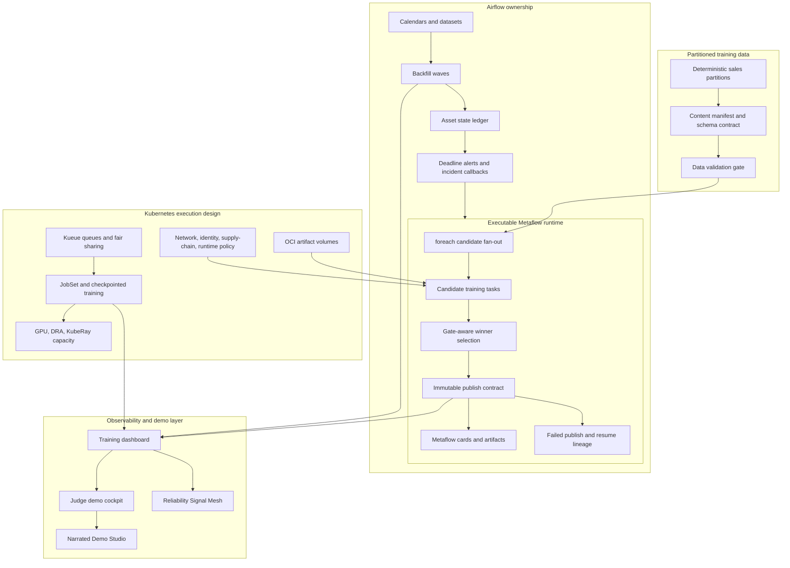

# Study Guide: Metaflow and Airflow Training Orchestration

This guide explains the full training platform, how to read the screenshots, and what production orchestration ideas the project demonstrates.

## Full Architecture



The key design principle: Airflow owns time, dependencies, and operational recovery. Metaflow owns the model code graph, task artifacts, candidate fan-out, and run lineage.

## Screenshot Walkthrough

Fresh full-page captures from the generated app are available as a linear demo path:

| Step | Screenshot | What it proves |
| --- | --- | --- |
| 0 | `docs/screenshots/study-00-artifact-index.png` | The generated artifact index gives reviewers one launch point. |
| 1 | `docs/screenshots/study-01-main-dashboard.png` | The training dashboard is readable end to end. |
| 2 | `docs/screenshots/study-02-judge-cockpit.png` | The portfolio cockpit groups evidence by reviewer intent. |
| 3 | `docs/screenshots/study-03-operator-drill.png` | Training failure recovery is rehearsed as an operator workflow. |
| 4 | `docs/screenshots/study-04-reliability-signal-mesh.png` | Orchestration signals are connected before release decisions. |
| 5 | `docs/screenshots/study-05-narrated-demo-studio.png` | The narration and video plan can be reviewed without running tools. |

1. **Training dashboard**: `docs/screenshots/dashboard.png`
   Shows partitions, candidate results, gates, publication identity, and backfill behavior.

2. **Checkpoint training readiness**: `docs/screenshots/dashboard-checkpoint-training.png`
   Explains checkpoint cadence, queue policy, restore budget, GPU fit, and distributed training readiness.

3. **Checkpoint recovery timeline**: `docs/screenshots/dashboard-checkpoint-timeline.png`
   Shows how a failed distributed training job resumes and whether it meets the recovery objective.

4. **Event dedupe panel**: `docs/screenshots/dashboard-event-dedupe.png`
   Demonstrates idempotent event handling and duplicate suppression for orchestration signals.

5. **Judge demo cockpit**: `docs/screenshots/dashboard-judge-cockpit.jpg`
   Presents the evidence bundle by reviewer intent: release, orchestration, governance, and operator handoff.

6. **Operator drill lab**: `docs/screenshots/dashboard-operator-drill.png`
   Walks through a training failure, containment, retry, resume, and postmortem evidence.

7. **Reliability Signal Mesh**: `docs/screenshots/dashboard-reliability-signal-mesh.png`
   Connects Airflow asset states, resource admission, SLOs, and release decisions.

8. **Narrated Demo Studio**: `docs/screenshots/dashboard-narrated-demo-studio.png`
   Provides voice/video planning artifacts for a polished portfolio walkthrough.

9. **Mobile captures**: `docs/screenshots/dashboard-mobile.png`, `docs/screenshots/dashboard-checkpoint-training-mobile.png`, `docs/screenshots/dashboard-checkpoint-timeline-mobile.png`
   Confirm that the demo remains usable in narrow review contexts.

## How To Study The Code

| Area | Files | What to learn |
| --- | --- | --- |
| Local orchestration | `orchestrator.py`, `data.py`, `model.py`, `capacity_planner.py` | Deterministic partitions, bounded fan-out, backfill capacity |
| Metaflow runtime | `metaflow_runtime.py`, `metaflow_flows/demand_training_flow.py` | Real FlowSpec, cards, artifacts, resume contract |
| Airflow mapping | `airflow/dags/*.py`, `airflow_stateful_orchestration.py`, `asset_partitioning.py` | DAG parsing, asset state, partitions, deadlines |
| Kubernetes depth | `checkpoint_training_readiness.py`, `oci_artifact_volume.py`, `cohort_fair_sharing.py`, `kuberay_capacity.py` | Distributed training and queueing design |
| Demo layer | `dashboard.py`, `demo_cockpit.py`, `narrated_demo_studio.py`, `artifact_index.py` | How the training evidence becomes a teachable UI |

## Commands To Reproduce

```bash
make clean
make demo
make test
make ci-verify
open .local/reports/index.html
open .local/reports/training_orchestration_dashboard.html
open .local/reports/narrated_demo_studio.html
```

To exercise the real Metaflow contract:

```bash
make metaflow-runtime-contract
make metaflow-resume-contract
```

## Interview Talking Points

- **Airflow and Metaflow should not compete.** Airflow handles schedules, backfills, assets, and cross-team dependencies; Metaflow handles model code, artifacts, retries, and lineage.
- **Fan-out needs bounds.** Candidate search is controlled with validated grids, resource budgets, and deterministic selection.
- **Publication must be immutable.** The registration key includes partition, input content, selected config, and runtime contract version.
- **Recovery is part of the lifecycle.** The project proves failed publish boundaries, retry exhaustion, and resumed lineage instead of only training a successful model.
- **Kubernetes adds scheduling economics.** Kueue, JobSet, DRA, checkpointing, and OCI artifact volumes matter when training becomes expensive and multi-tenant.

## Learning Outcomes

After studying this repository, you should be able to explain partitioned training orchestration, Metaflow FlowSpec contracts, Airflow asset-aware backfills, checkpointed distributed training readiness, idempotent model publication, and how to design a training platform that survives failed partitions and overloaded clusters.
